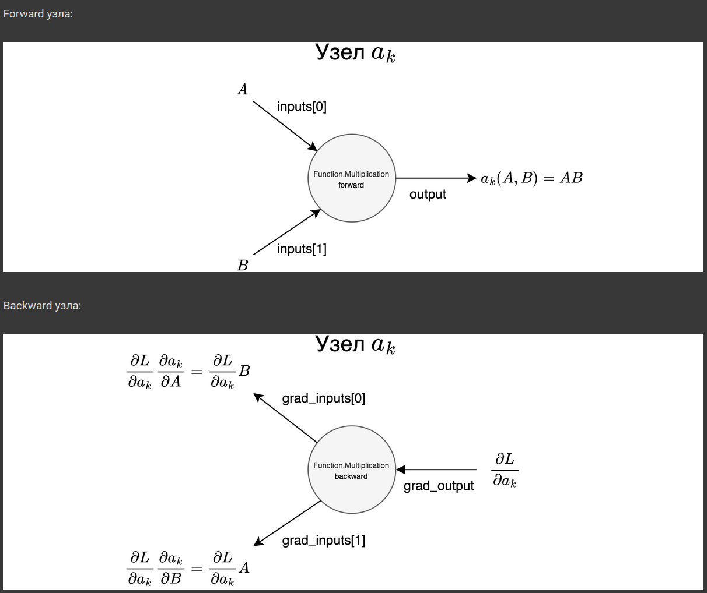
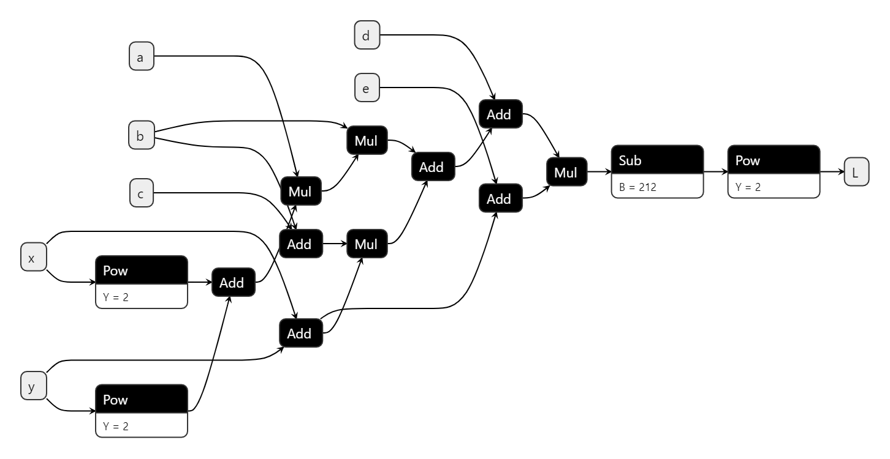
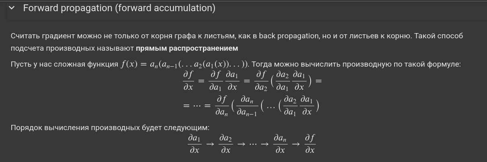
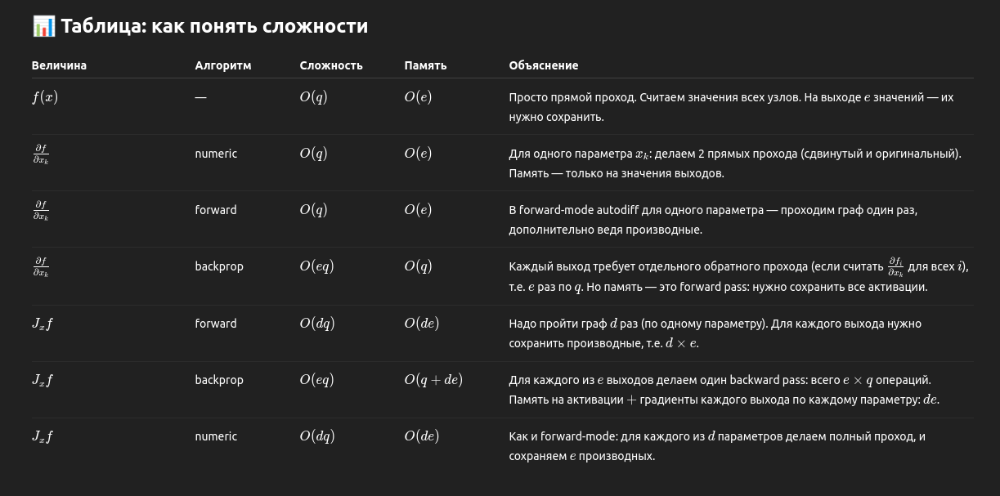

# 3.**Метод back propagation**. Как устроены, какая вычислительная сложность и сложность по памяти. Activation checkpointing. Обучение в условиях ограниченной памяти.

Яндекс https://education.yandex.ru/handbook/ml/article/metod-obratnogo-rasprostraneniya-oshibki
Семинар https://education.yandex.ru/handbook/ml/article/metod-obratnogo-rasprostraneniya-oshibki
 
 Из семинара:
 𝑓 может быть представлена в виде вычислительного графа, каждый узел которого обозначает операцию над переменной, то есть, операцию над каким-то числом, вектором, матрицей или тензором.
 Пример графа
 
  
## Три способа: forward prop, back prop и numeric.




# Activation Checkpointing

**Activation checkpointing** — это **техника уменьшения потребления памяти** при обучении нейронных сетей, особенно **глубоких**.

---

## 🧠 Проблема:

Во время **обратного прохода (backpropagation)** нужно:
- вычислить градиенты,
- для этого — использовать **значения активаций**, полученных на прямом проходе (forward pass),
- но если сеть очень глубокая, хранение всех активаций (на каждом слое) требует **много памяти** — это **узкое место при обучении на GPU**.

---

## ✅ Решение: **Activation Checkpointing**

Идея простая:

> **Сохранять не все активации, а только некоторые контрольные точки (checkpoints), а остальные пересчитывать "на лету" во время backpropagation.**

---

## 📉 Что происходит на практике:

1. Во время **forward pass**:
   - сохраняем только **некоторые активации** (например, каждые 5 слоёв),
   - остальные **не сохраняются** — значит, меньше памяти используется.

2. Во время **backward pass**:
   - если нужна активация, которая **не была сохранена**, она **перевычисляется** начиная с ближайшей сохранённой "контрольной точки".

---

## 🔁 Компромисс:

| Ресурс      | Обычное обучение | С checkpointing |
|-------------|------------------|-----------------|
| 💾 Память   | высокая          | значительно ниже |
| ⏱️ Время    | оптимальное      | выше (из-за пересчёта) |

Ты экономишь память **в обмен на дополнительное время**.

---

## 📦 Где это используется?

- Трансформеры (GPT, BERT и др.), когда модель **слишком большая**.
- Библиотеки: PyTorch, TensorFlow и др. поддерживают activation checkpointing встроенно:
  ```python
  from torch.utils.checkpoint import checkpoint

  def forward_fn(x):
      return model_block(x)

  output = checkpoint(forward_fn, input)
  ```

---

## 🧪 Пример:

Если у тебя сеть из 100 слоёв, можно:
- сохранить активации только на слоях 0, 20, 40, 60, 80, 100;
- при backpropagation восстанавливать промежуточные активации между ними при необходимости.

---

## ✍️ TL;DR:

> **Activation checkpointing** — это метод уменьшения использования GPU-памяти во время обучения нейросети за счёт сохранения только части активаций и их повторного вычисления при обратном проходе. Экономит память, но замедляет обучение.
