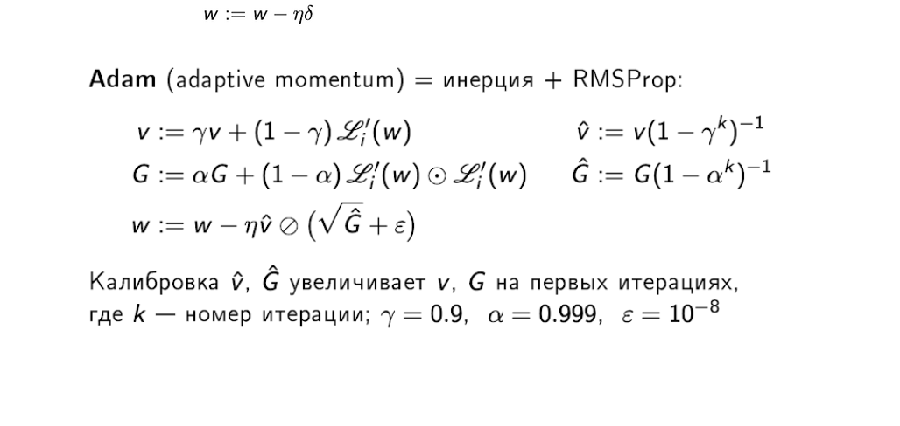

# Метод моментов Поляка. Чем отличается имплементация в Pytorch от оригинального метода. Метод Adam. Почему он устроен именно так.

Семинар про оптимизаторы: https://colab.research.google.com/drive/1sNV5LtBuddoUmvi0e6z49_1Jaejbmx6Y#scrollTo=dneY7weJnOr1
Прочитать про метод моментов, там же расписано отличие Поляка от Pytorch

## Adam 
В семинаре расскказывается про AdaGrad и RMSProp. Далее Adam есть моменты + RMSProp (https://docs.google.com/document/u/0/d/1PeahfK17HZC6vJe7jDnsmMM0xhn9w3hIA2ZOaCIZLrE/mobilebasic):

Метод моментов позволяет градиентному спуску быть более устойчивым к неожиданным перепадам, узким локальным минимумам, а также быстрее проходить овраги.

Однако задачи устойчивости и длины градиентного шага - все же разные, хоть, конечно, и являются комплиментарными.

